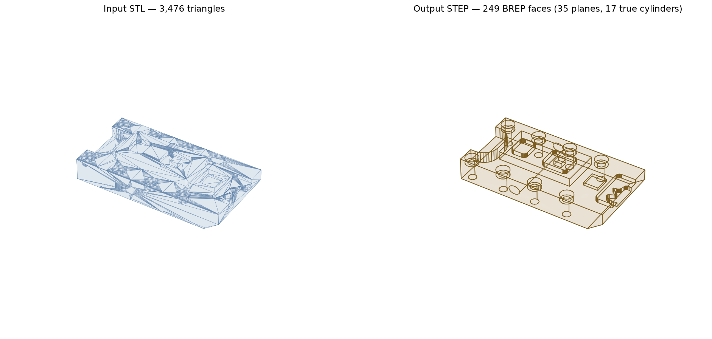
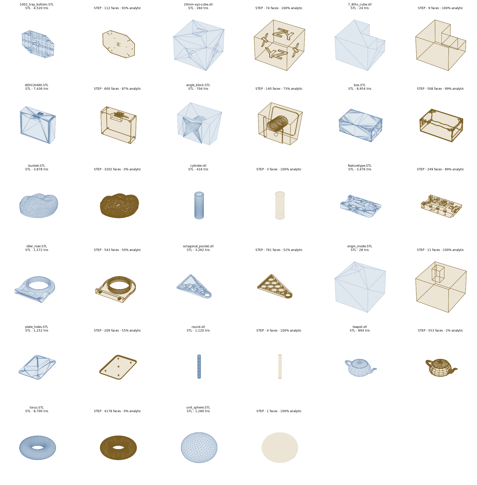

# breptile

Convert STL triangle meshes into clean, **editable** STEP BREP models — not just a
tessellated dump. Planar regions become single planar faces; cylindrical holes and bosses
become true analytic cylinders; spherical countersinks and domes become real spheres.
Anything that can't be fitted within tolerance falls back to faceted geometry and is
flagged in a JSON report for manual (or LLM-assisted) rebuild.



*Left: input STL (3,476 triangles). Right: converted STEP — 249 BREP faces with 35 planes
and 17 true cylinders. Every hole selects as a single cylindrical face in CAD.*

## Why

STL files carry no topology and no analytic surfaces, so most "STL to STEP" converters
emit one planar face per triangle — a file that opens in CAD but is unusable for editing,
CAM, or feature recognition. `breptile` reconstructs analytic surfaces instead, with a
hard guarantee: **every fitted surface passes through the mesh vertices within a
configurable tolerance, and dimensions are never snapped.**

## Install

```bash
python3 -m venv .venv
.venv/bin/pip install breptile        # or: pip install -e . from a checkout
```

Requires Python 3.10–3.13 (needs OCP/build123d wheels). Dependencies: build123d,
trimesh, numpy, scipy, manifold3d, rtree, networkx.

## Use

```bash
breptile input.stl output.step                      # auto: fit primitives, per-region fallback
breptile input.stl output.step --mode tessellated   # guaranteed success, faceted STEP
breptile input.stl output.step --mode prismatic     # planes only
breptile input.stl output.step --tol 0.01 --report report.json --verify
```

| Flag | Meaning |
|---|---|
| `--tol` | max deviation of any fitted surface from mesh vertices (default: bbox diagonal × 1e-4) |
| `--verify` | re-tessellate the STEP and report two-sided sampled deviation vs the input |
| `--report` | write a JSON report: region counts, fit residuals, fallbacks |
| `--force` | convert non-watertight meshes as open shells |
| `--max-triangles N` | decimate large inputs first |

Or from Python:

```python
from breptile import convert
report = convert("input.stl", "output.step", mode="fit", tol=0.01)
```

## How it works

1. **Load & repair** (trimesh + manifold3d): normals, holes, degenerate faces; clear
   error on non-watertight input.
2. **Segment**: region-grow smooth patches by dihedral angle; classify each by
   least-squares fit — plane → cylinder → sphere — validated against `--tol`.
   Cylinder axes come from the facet-normal cloud; fits are refined with
   Levenberg–Marquardt.
3. **Rebuild BREP** (OpenCascade via OCP):
   - planar regions → single faces with hole wires;
   - full-wrap cylinders and spherical bands/caps → analytic faces with **exact circular
     rims shared with neighboring faces**, so sewing closes analytically;
   - partial cylinders/sphere patches → trimmed patches with the parametric seam rotated
     into the region's angular gap;
   - a u/v coverage check prevents a fit from claiming surface the mesh doesn't cover;
   - everything else stays faceted (honest fallback).
4. Sew → solid → `ShapeUpgrade_UnifySameDomain` → `ShapeFix` → `BRepCheck` → STEP
   (AP214 or AP242).

## Benchmark

Run on the [trimesh model corpus](https://github.com/mikedh/trimesh/tree/main/models)
(`python benchmark/run_benchmark.py`):



Highlights — 17/18 models produce a valid STEP solid (the 18th is deliberately random
triangle soup, which degrades to a flagged open shell):

| Model | Triangles → faces | Analytic | Notes |
|---|---|---|---|
| cylinder | 416 → **3** | 100% | 2 planes + 1 cylinder |
| unit_sphere | 1,280 → **1** | 100% | single spherical face |
| featuretype | 3,476 → 249 | 89% | 17 true cylinders |
| ADIS16480 | 7,436 → 600 | 87% | 24 cylinders, 20 spheres |
| 1002_tray_bottom | 4,520 → 112 | 93% | 22 cylinders |
| teapot / torus | — | ~0% | organic → faceted fallback |

Verified deviation stays at or below the input mesh's own chord error in all cases — on
coarse meshes the analytic surface is *more* accurate than the STL that described it.

## Hybrid LLM workflow

`.claude/skills/breptile/SKILL.md` teaches Claude (or any agent) to run the pipeline,
read the report, and rebuild the regions the fitter couldn't handle as build123d code —
then verify the result against the original mesh. Regions carry their fitted parameters
(axis/center/radius) even when rejected, giving the agent measured starting points.

## Limitations

- Cones, tori, fillet blends, and freeform surfaces fall back to facets (cone and NURBS
  fitting are the roadmap).
- Organic/scanned shapes convert tessellated — a valid STEP, but not parametric.
- Coplanar-but-disconnected regions are not merged across bodies.

## Development

```bash
.venv/bin/pytest            # round-trip tests on generated fixtures
python benchmark/run_benchmark.py
```

MIT licensed. Issues and PRs welcome.
